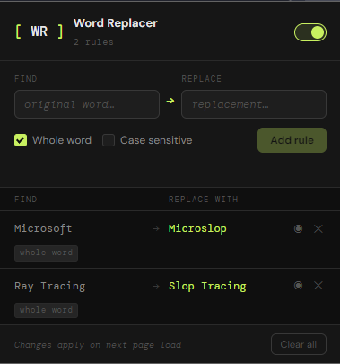
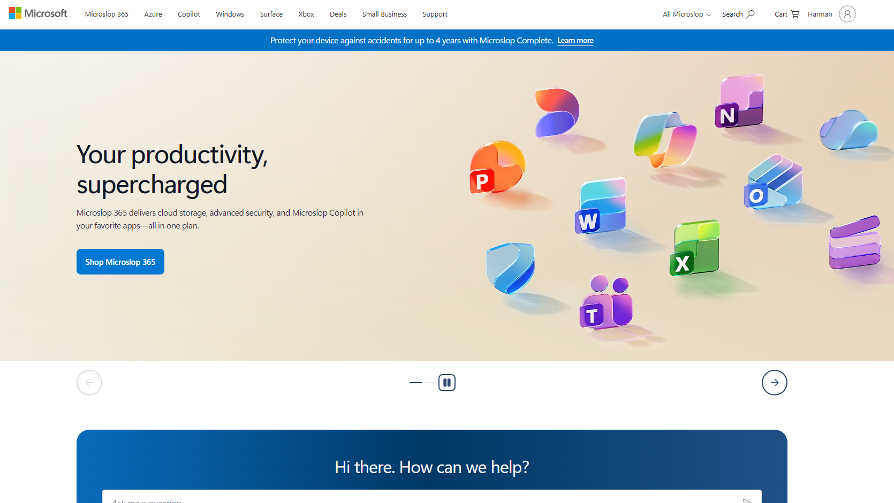
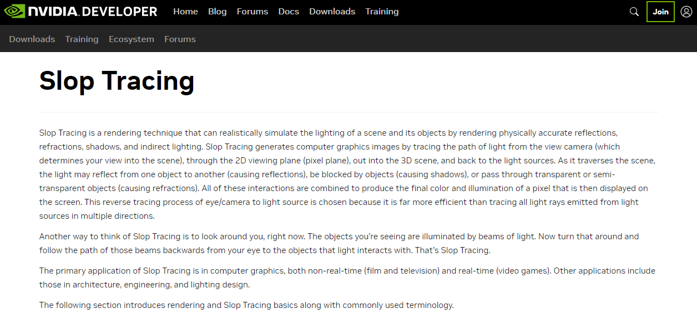
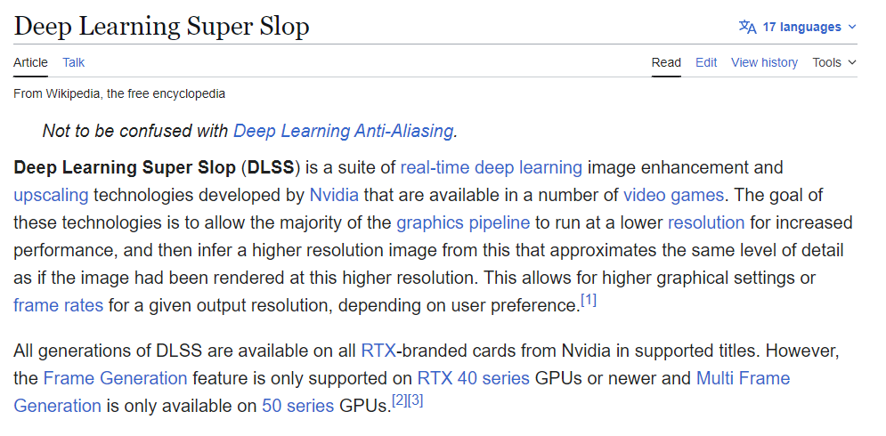

# Custom word replacement Browser Extension

Browser extension that allows you replace all instances of a word on a webpage with another word of your choice.

You get to specify any word you want to replace and the word you want to replace it with. The extension will then scan the webpage and replace all instances of the specified word with the new word.

> [!NOTE]
> This extension is entirely inspired by [this extension by Reddit user u/aymantargaryen](https://chromewebstore.google.com/detail/microsoft-to-microslop/hlkljlkdinjnbfmclionhbefbnefcgll). All credit goes to them for the original idea and implementation. I just wanted to create my own version of it and add some extra features.

## Examples

### Microsoft > Microslop

### NVIDIA Ray Tracing > Slop Tracing

### DLSS > Deep Learning Super Slop

